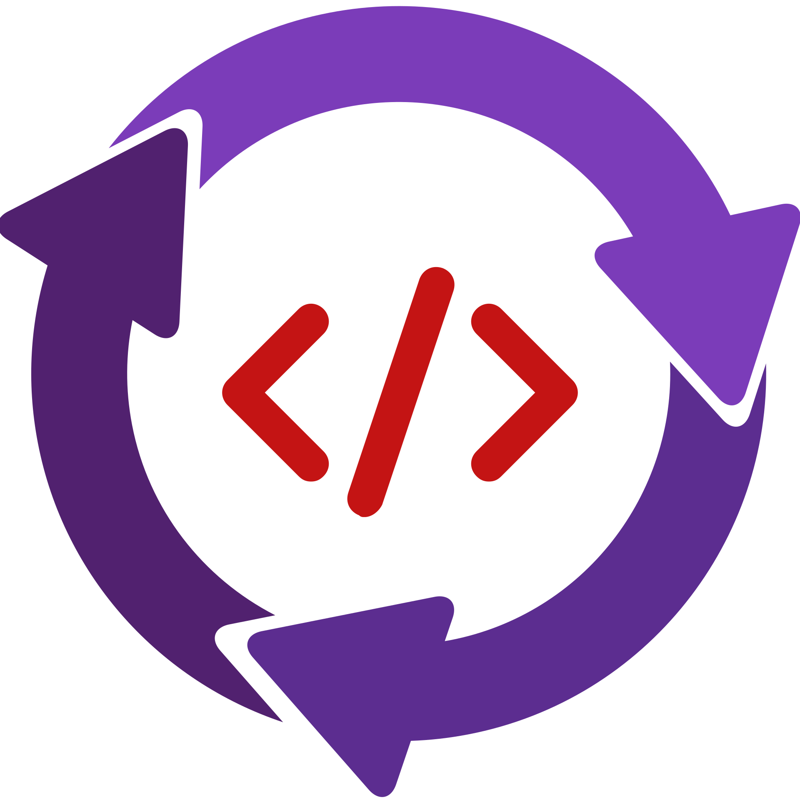

<div align="center">
  
  <h1>Translate</h1>
  <p><a href="/docs/README-EN.md">English</a></p>
  <p><a href="https://github.com/BarudakRosul/translate/issues/new?assignees=&labels=bug&projects=&template=bug_report.yml">Laporkan Bug</a> · <a href="https://github.com/BarudakRosul/translate/issues/new?assignees=&labels=enhancement&projects=&template=feature_request.yml">Ajukan Fitur</a></p>
  <p>
    <a href="https://github.com/BarudakRosul/translate/actions/workflows/test.yml"></a>
    <a href="https://npmjs.com/package/@barudakrosul/translate"></a>
    <a href="/LICENSE"></a>
    <a href="https://npmjs.com/package/@barudakrosul/translate"></a>
    <a href="https://github.com/BarudakRosul/translate/stargazers"></a>
    <a href="https://github.com/BarudakRosul/translate/network/members"></a>
    <a href="https://github.com/BarudakRosul/translate/issues"></a>
  </p>
  <a href="https://techforpalestine.org/learn-more"></a>
</div>

## Daftar Isi

1. [Pendahuluan](#pendahuluan)
2. [Fitur](#fitur)
3. [Instalasi](#instalasi)
4. [Penggunaan](#penggunaan)
5. [Berkontribusi](#berkontribusi)
6. [Lisensi](#lisensi)
7. [Penghargaan](#penghargaan)
8. [Donasi](#donasi)
9. [Catatan Perubahan](#catatan-perubahan)

## Pendahuluan

Translate adalah sebuah ekstensi JavaScript yang mengubah setiap karakter dalam sebuah string ke karakter lain berdasarkan tabel terjemahan yang disediakan. Ini dibuat semirip mungkin dengan `translate()` di Python.

## Fitur

Translate menawarkan fitur-fitur berikut:

- Mengganti setiap karakter dalam string berdasarkan tabel terjemahan yang diberikan.
- Mudah digunakan dengan dukungan Unicode.
- Dapat di integrasikan ke dalam kode TypeScript.

## Instalasi

Untuk menginstal Translate secara lokal, ikuti langkah instalasi ini:

```shell
npm install @barudakrosul/translate
```

## Penggunaan

Untuk memulai menggunakan Translate, import modulnya terlebuh dahulu:

**1\. CommonJS**
```javascript
require("@barudakrosul/translate");
```

**2\. ESM (ECMAScript Modules)**
```javascript
import "@barudakrosul/translate";
```

**3\. TypeScript**
```typescript
import "@barudakrosul/translate";
```

Contoh penggunaan:

```javascript
let table = {
  65: 66, // A -> B
  66: 67, // B -> C
  67: 68  // C -> D
};

let text = "ABC";
console.log(text.translate(table));

// Result:
// BCD
```

Contoh apabila yang ditranslasi adalah emoji:

```javascript
const table = {
  0x1F600: 0x1F601,  // 😀 -> 😁
  0x1F602: 0x1F923   // 😂 -> 🤣
};

console.log("😀 😂".translate(table));

// Result:
// 😁 🤣
```

## Berkontribusi

Kontribusi pada Translate sangat dihargai! Baik melaporkan bug, menyarankan fitur baru, atau berkontribusi pada perbaikan kode.

## Lisensi

Translate dilisensikan di bawah Lisensi Apache-2.0 - lihat berkas [LICENSE](/LICENSE) untuk detailnya.

## Penghargaan

Translate menghargai dukungan dan kontribusi dari individu dan proyek sumber terbuka berikut:

- [@FajarKim](https://github.com/FajarKim) - Pengembang utama dan pencipta aplikasi.
- Komunitas sumber terbuka - Untuk kontribusi berharga pada alat dan perpustakaan yang digunakan dalam proyek ini.

## Donasi

Kami sangat menghargai dukungan Anda untuk terus mengembangkan proyek ini. Jika Anda merasa proyek ini bermanfaat, Anda dapat mendukung kami dengan donasi:

[](https://ko-fi.com/barudakrosul)
[](https://trakteer.id/barudakrosul)

Setiap donasi, berapapun jumlahnya, sangat berarti bagi kami. Terima kasih atas dukungan Anda! ❤️

## Catatan Perubahan

Terus ikuti perubahan dan pembaruan terbaru Translate dengan mengacu ke [Catatan Perubahan](https://github.com/BarudakRosul/translate/releases).

Terima kasih telah memilih Translate! Kami bertujuan untuk memberikan solusi yang mudah mudah untuk mengganti setiap karakter dalam string berdasarkan tabel terjemahan yang disediakan.

[](https://techforpalestine.org/learn-more)